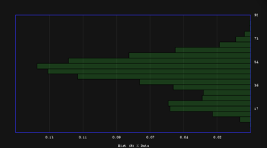

## Data presentation/exploration tool

Variety of plotting routines for viewing and exploring data.

Very much a work-in-progress when I am finding time to put in. Look at TODO for some idea of what is and what is next.

### Examples

All of these examples are displaying the same set of data.

#### Scatterplot

#### Boxplot 
 

#### Histogram
 
 

#### Empirical CDF

#### Hexbin

## Requirements

Allegro5 at least. Probably much more.
